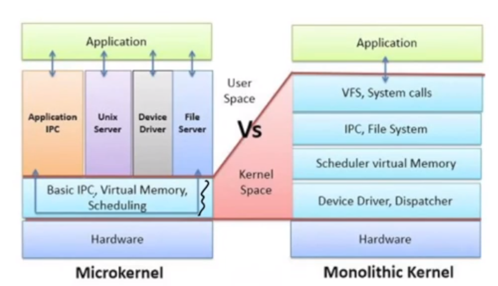

# 4. kernel

- kernek
	- internal services provided by kernel
	- internal services contain most important os function
	- core of the OS/center module of OS
	- remaining services are provided by other modules (firmware(controlls internal hw) and device drivers(controls external hw))  
	- and those modules are controlled by kernel 
	- it manages memory access for programs in ram
	- it determines which programs get access to which hardware resources
	- sets up or resets cpu's operating status for optimal operation
	- organizes data for long term non volatile storage with file system

- kernel services
	- modes(user, supervisor)
	- memory management
	- virtual memory
	- program execution and proces management
	- multitasking
	- disk access and file system management
	- interrupts handling

- kernel uses
	- allocate memory to programs that need it
	- schedule time for its execution
	- provide communication between executing programs
	- provide security to other modules and services

- types
	- monolithic kernel
		- all os services run along main kernel thread, thus residing in same memory area
		- this provides rich and powerofull hardware, all runs in sudo
		- but the dependencies b/w the system components could cause system crash due to a driver crash
	- microkernel
		- the functionality of system is moved out of traditional kernel into set of servers that communicate through minimal kernel leaving as little in system space and as much possible in user space
	- 