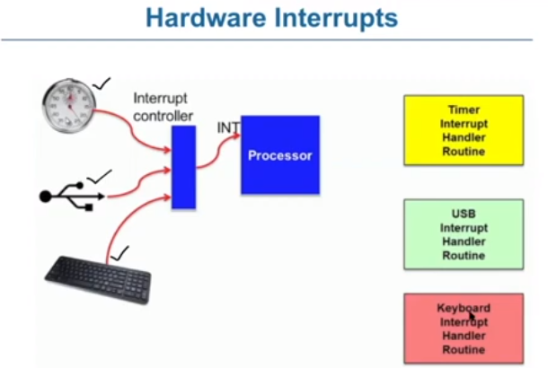
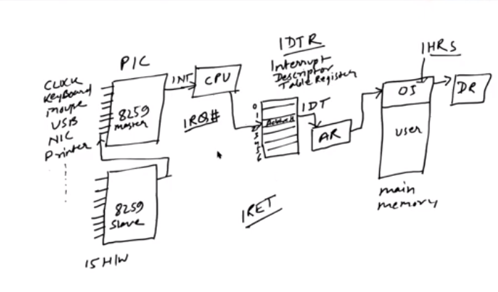
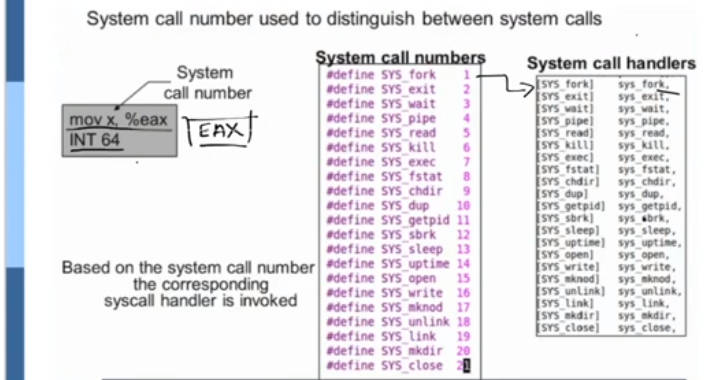

# 5. Intrerrupt

- os is event driven
	- executes only when there is interrupt

- Events
	- hardware inturrupts
		- just called inturrupt
		- raised by hardware devices
		- are asynchronous may occur anytime
	- traps
		- known as software intrerrupt
		- raised by user programs, to invoke os functionality
	- exception
		- generated automatically by processor itself as a result of an illegal instruction
			- faults
				- recoverable error like page fault
			- aborts
				- non recoverable such as divide by 0

**Hardware Interrupt**
- 
- the hardware action from any hardware like clock, printer, usb, heyboard goes to the interrupt controller(hardware controller which decides the priority to take which hw first )
- the this connects that hw to the INT pin in the proceessor .. then the interrupt handler routines run like
	- time interrupt handler routine
	- usb intterrupt handler routine
	- keyboard interrupt handler routine
- the int returns interrupt request number (IRQ#) to the cpu
- this no. is looked up in an interrupt descriptor register which stores addresses of the interrupt handler routines, which is then fetched .. which then returns Interrupt Return(IR) which changes to user mode and user programme is executed.
- these days advance programmable interrupt controller (APIC) is used
- in short
	- hardware causes action
	- which is caught by interrupt controller
	- which sends the suitable interrupt to the interrupt pin
	- then pin returns interrupt req no.-
	- with IRQ# we search interrupt descriptor register
	- from where interrupt handler ruitine  is fetched
	- the interrupt handler routine runs 
	- the interrupt return (ir) is called which changes the thing to user mode, resume stopped program
- 

**Software Interrupt**

- here we have INT x which when executed causes a software interrupt, which changes user mode to kernel mode and executes respective system call
- example
	- read file, write file,display data, packet sent through network
- software interrupt used for implementing system calls
- type of System Int. used for implementing system calls
	- in linux INT 128 is used
	- in xv6, INT 64 used for system call
- type of system calls
	- process control (create, end, execute, wait, malloc, dump)
	- file management (create, open close, read, write)
	- device management (request device, release, read, write, logically attach detach devices)
	- information maintaince (get/set time, data, system data, process/file/device attributes)
	- communinication (create delete connection, send, recieve messeges, transfer status, attach/detach remote devices)
	- protection(control access, get/set permission, allow/deny user access)

- once the system call is made system call no. is used to access system call handler which then handles the interrupt and gives out IRET to resumes the program

- 
