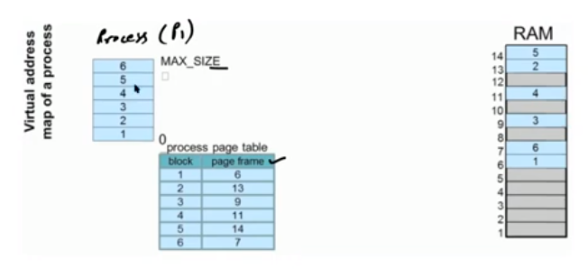
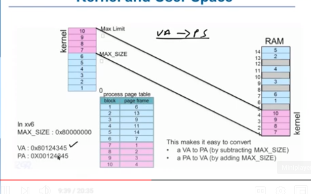
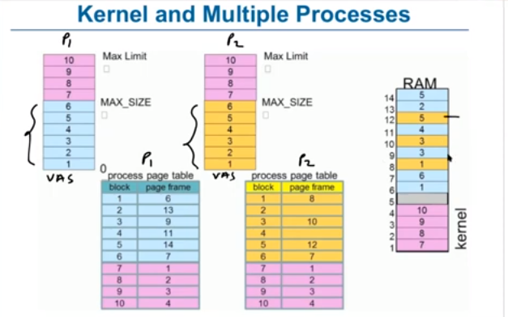
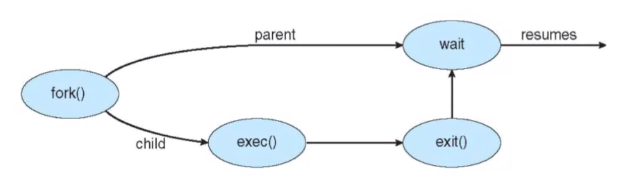
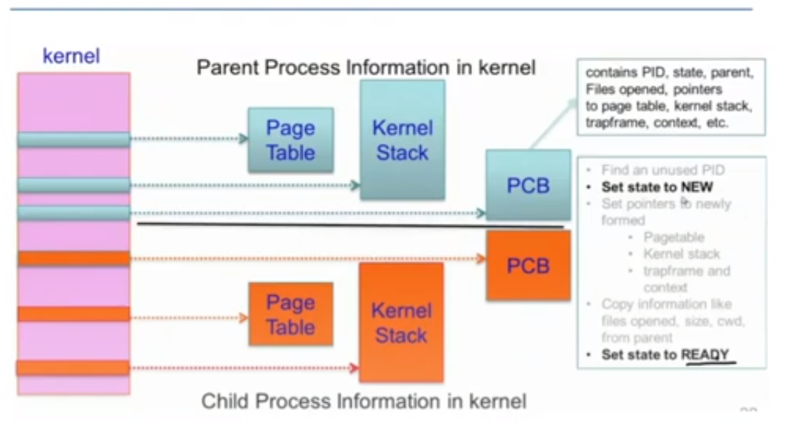
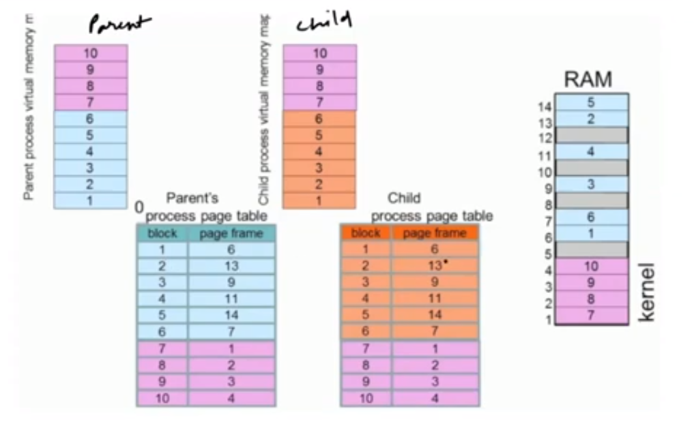
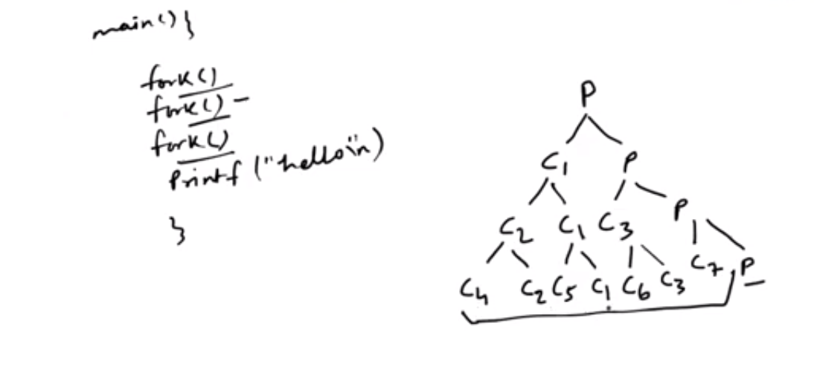
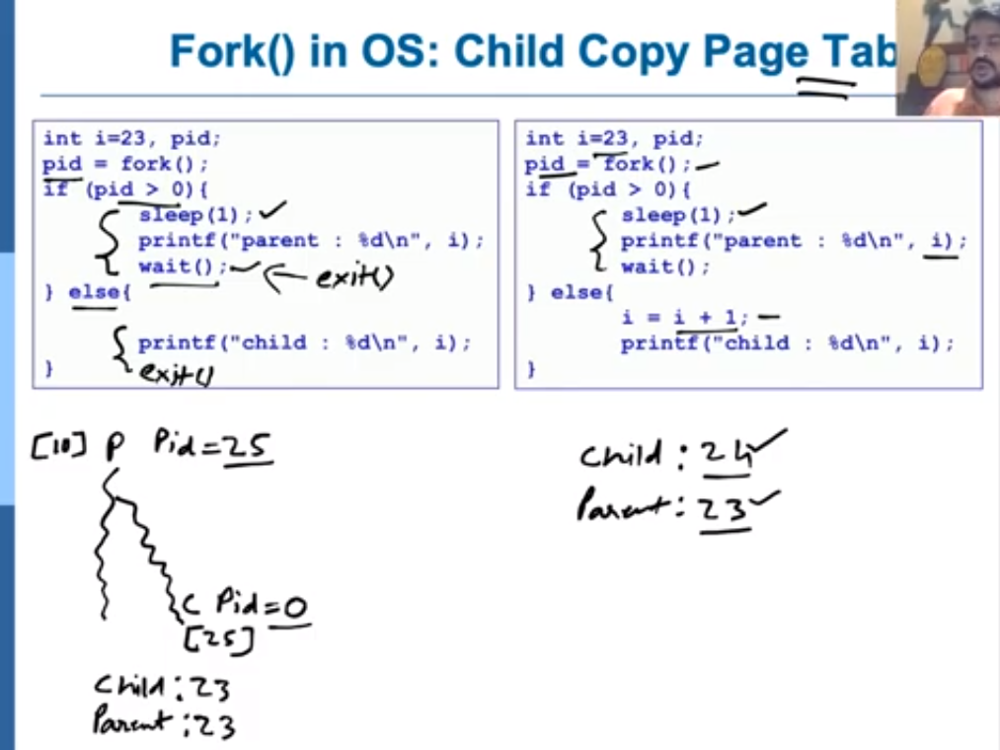

# 7. Process II


**Process in virtual memory space**

**page table**
- the each row in the memory page is called page frame
- the each row in virtual memory is called block
	- sizeOf(block) is equal to sizeOf(frame)
- there is a mapping between the process block and page frame for mapping virtual address memory and physical memory
	- 
- to convert virtual address to physical address we subtract from max size. and vice versa
- in ram the kernel memory will have one whole concequtive section of frames
	- 
- for multiple processes
	- 

- kernal keeps metadata about each process (metadata)
	- process control block(open file, closed file, register)
	- kernal stack for user process (stored in the kernel part of virtual memory)
	- page table for user process


- process stack (each process has 2 stack)
	- user space stack
		- used when executing user code
	- kernal space stack
		- used when kernal code in the context of the process(eg. during system call exec we store, so we know we need to go back to the parent terminal etc.)
		- even if user stack is affected then also kernal can execute
	
--------

			
**Operations on process**

- Creation
- Scheduling
- Execution
- Killing/delete


- process creation
	- parent process creates child processes, thus make a tree
	- process identified and managed by pid (process identified
	- resource sharing
		- parent and children share all resources
		- children share subset of parent's resources
		- parent and child share no resources
	- execution options
		- parent and children execute concurrently
		- parent waits until children terminates




- fork createss child dublicate or parent by cloning
	- creating process by cloning
	```
	int p;
	p = fork();
	if(p > 0){
		printf("Parent : child PID = %d", p);
		p = wait();
		printf("Parent : child %d exited\n", p);
	}
	else if (p == 0){
		printf("In child process");
		exit(0);
	} else{
		printf("Error\n");
	}
	}
	```


- fork tasks in kerne
	- 
	- the page table is also copied from parent to child
		- 

- using fork in c

	```
	int main(){
		fork();
		fork();
		fork();
		printf("hello");
	}
	/*output : 
	hello
	hello
	hello
	hello
	hello
	hello
	hello
	hello
	*/
	```
- 


**Process creation

- child copy parent table
	- 

- copy on write (cow)
	- at start the parent pages are shared
	- but if shared page change, os stops and make a copy of 'that' page only


- executing new program
	- fork
	- exec
		- find the executable from hard disk
		- load on demand pages required to execute

**process termination**
- voluntary termination
	- exit()
		- called in child, causes termination, returns 0 to parent
- involuntary termination
	- kill(pid, signal)
		- can be sent by os/other process
- wait()	
	- parent calls, if exit() returns zero here we can resume


- types
	- cascading termination
		- if parent terminates, all children and their children need to terminate
	- zombie
		- if child process terminates it becomes zombie (defunct process)
			- pcb still exists 
			- parent process reads child status here by wait
			- after read status zombie entry removed (reaped)
			- if parent doesn't read status, os periodic reaper process will collect and remove entry
	- orphan
		- if parent terminates before child
		- adopted by super process
		- types
			- unintentional orphan
				- when parent crash
			- intentional orphan (daemons)
				- process detach from user session and run in background
				- used to run background services
				- in linux names end with d are daemons, e.g. bluetoothd
				- daemons can be invoked with 'systemctl start mysql' etc


