# 9. Scheduling algorithms

- main points
	- algo (FCFS, SJF, SRJF, Priority, RR)
	- burTim Pred.(static(size,type), dynamic(ave, expAve))
	- multilevel (queue, feedback queue)

**first come first served scheduling (FCFS)**

- criteria
	- according to arrival time process is scheduled
	- if arrival time s	ame
		- according to process id
- mode
	- non preemptive
- transition
	- ready to running
	- running to terminate
- gantt chart
	- 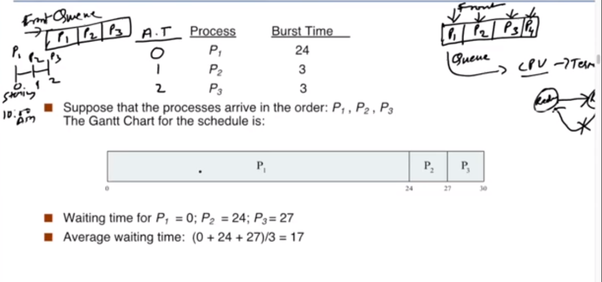
- table
	- 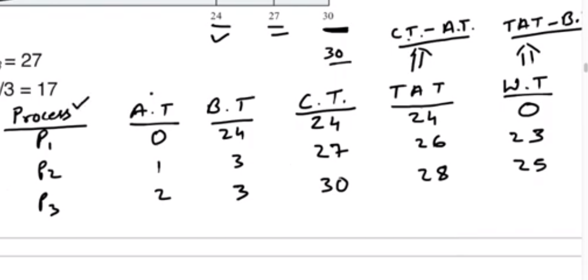
- average waiting time
	- (summation w.t of all processes)/ no. of processes
- average turnaround time
	- (summation t.a.t. of all processes)/ no. of processes

- example
	- 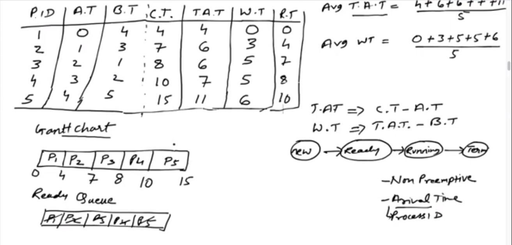
	- 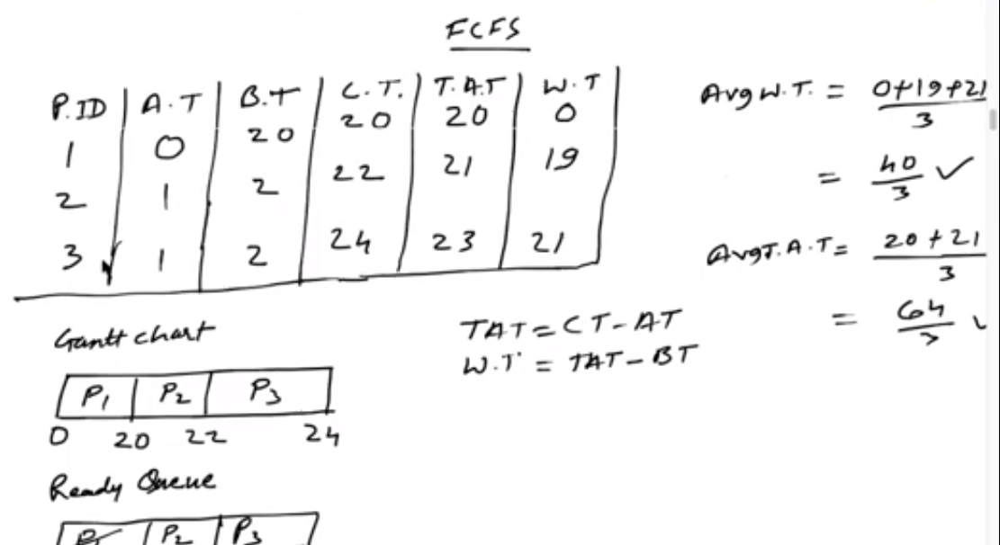
		- here the av. waiting time is too much, they starve, this is also known as convoy effect
		- if p2, p3 came before p1, w.t. would be very small
		- 
		- so we conclude that if we take burst time as criteria, then it will be better
	- 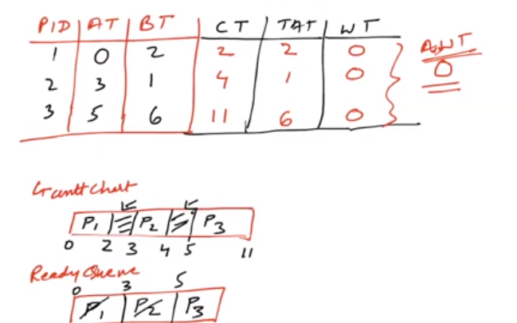
	- with context switching time = 1
		- 
- disadvantage
	- long waiting time 
	- long turn around time

**Shortest Job First (SJF)**

- criteria
	- process with lesser burst time
	- if burst time same
		- arrival time is considered
- mode
	- non preemptive
- requirement
	- process length should be known
- data structure used
	- min heap with burst time as key

- example
	- 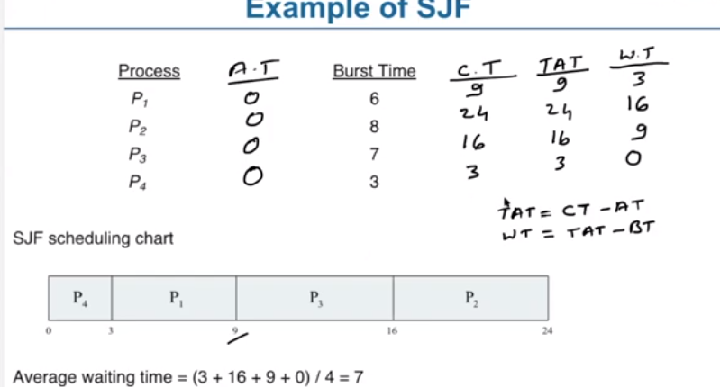
	- if processes come at different time, then also this scheduling is not idle
		- 
	- 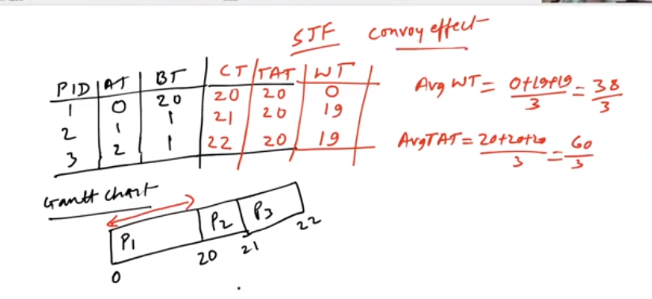
		- here we can see convoy effect/ starvation

- advantage
	- maximum throughput
	- gives minimum ave. waiting time

- disadvantage
	- difficult to know burst time (non practically possible)
	- convoy effect still there (if diff Arr.Time)

**Burst time prediction**
- statis method
	- process size
		- we see actual size of process in kb maybe
		- 
		- not very accurate because there are things like loop, i/o etc that can't be calculated here
	- process type
		- types
			- os process [3-5 units]
			- interactive process [5-8 units]
			- foreground process [10-15 units]
			- background process [15-20 units]
		- not really implementable/ not good enough
- dynamic method
	- simple averaging
		- we take moving average and then predict next process
		- not really suitable
	- exponential averaging (best)
		- 
		- alpha * (b.t. of last process) + (1-alpha) * (predicted b.t. of last process)
		- example
			- 

**Shortest Remaining Time First (SRTF)**
- criteria
	- burst time
		- arrival time as tie breaker
- mode
	- preemptive
- example
	- 
	- 
	- 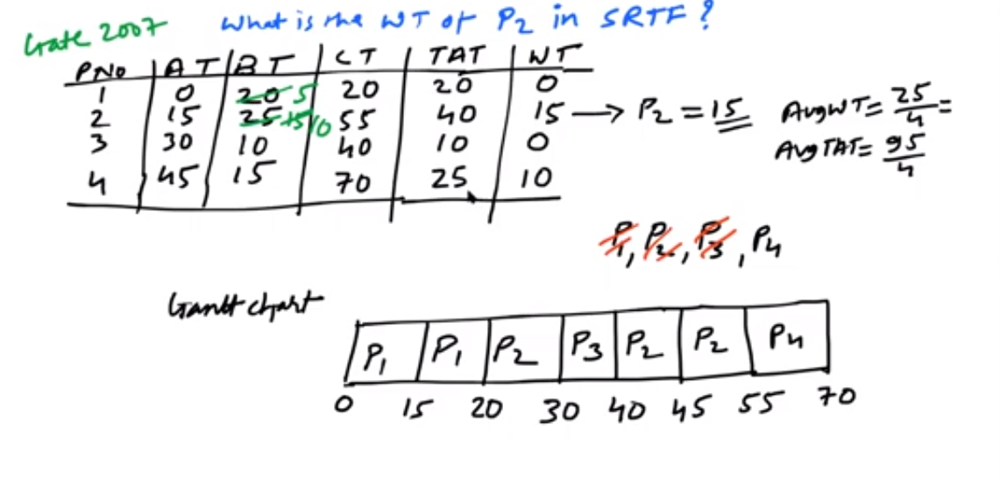

**Priority Scheduling**

- criteria
	- priority (integer associated with each process)
		- small integer	= higher priority
- mode
	- preemptive/non preemptive
- generalisation
	- SJF is a priority scheduling where priority is inverse of predicted next cpu burst time
- problem
	- starvation : low priority process may naver execute
	- solution : 
		- aging : as time progresses increase priority of process

- example
	- 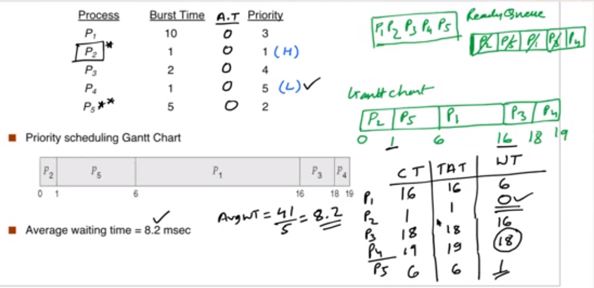
	- 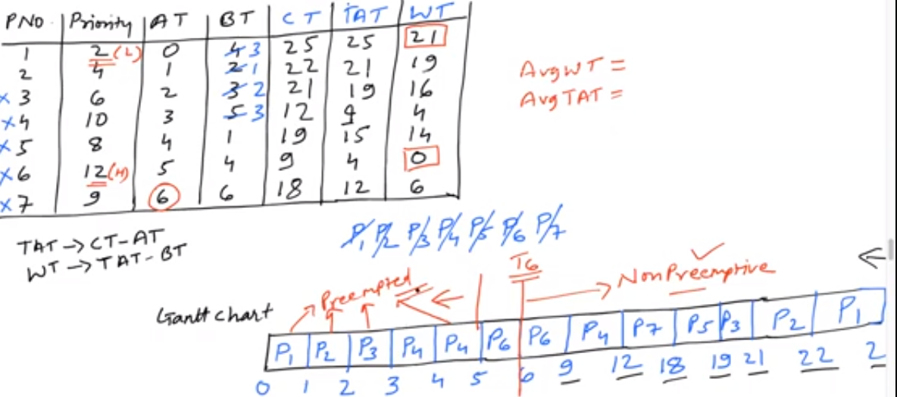
	- if explicitely non preemptive is said then, we will get a different gantt chart
		- 

**Round Robin scheduling**

- criteria
	- time quantum (Q, it is given)
		- timer interrupts every Q to schedule next process
		- each process gets 1/n of cpu processing
	- if multiple process, fcfs
- performance based on Q
	- q too large : it will act like FIFO
	- q too small : if q approx to context switch, overhead is too high
mode
	- preemptive
- flowchart
	- 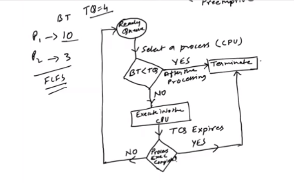
- example
	- 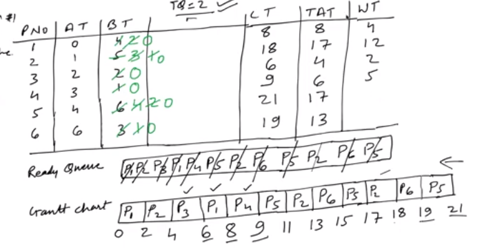
	- 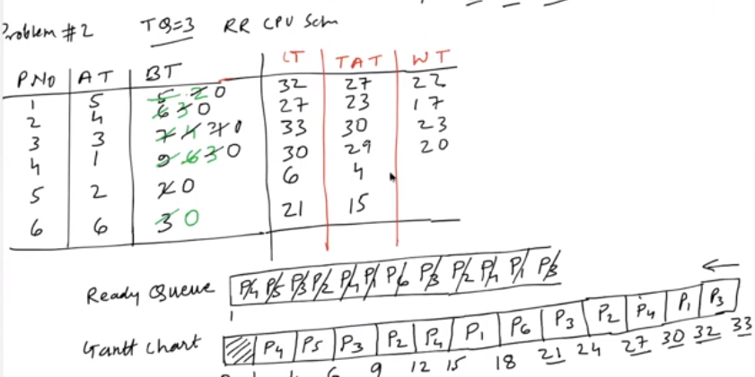

**Multilevel Queue**
- problem
	- we can not have system processes along with others in lets say only one scheduling algo
- solution
	- apply diff sche. algo on diff. kind of processes
	**high priority**
	- system processes - RR
	- interactive processes - SJF
	- batch processes - FCFS
	**low prioriry**
	
	
**Multilevel feedback queue**
- still problem
	- batch processes(low priority) may starve
- solution
	- we put all the diff. group queues in RR. with Q(time quantum) proportional to priority
	- 