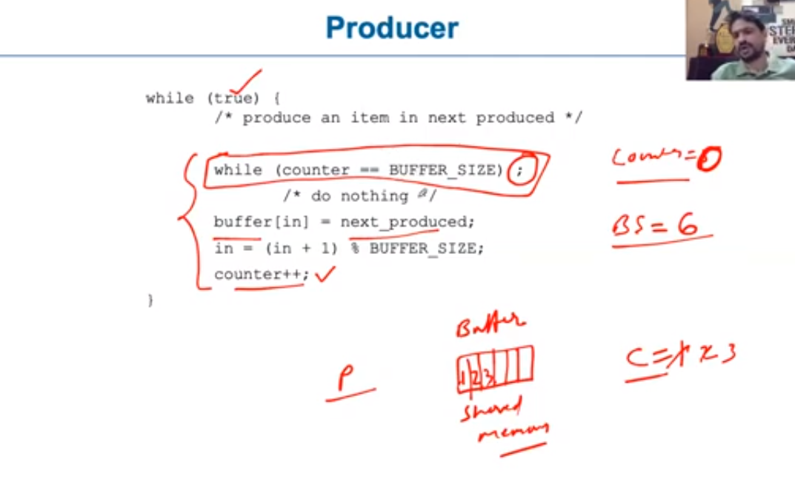
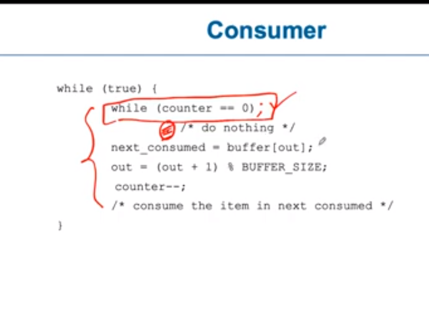

# 11. Inter process communication

**Introduction**
- definition
	- processes need to communicate
	- categories of processes based on communication
		- independent
			- won't affect each other
		- cooperative
			- can affect each other, as they share data with other process
			- sharable resources 
				- variable
				- codes
				- memory
				- h/w
					- cpu
					- printer

- reason for cooperation
	- information sharing
		- memory sharing and message passsing
	- commutation speed
		- we can use multiple threads, which will speed up
	- modularity
		- we can modularise process, make it easier to implement
	- convenience
		- yes

- Inter process communication (IPC) mechanism
	- shared mechanism
		- a region of memory is shared, so by reading and writing we can communicate
	- message passing
		- processes exchange message, though communication channel(socket, through kernel etc)

- example
	- producer and comsumer
		- producer
			- 
		- consumer
			- 

- kinds of buffer
	- unbounded buffer
		- consumer doesn't has to wait 
		- doesn't work in single thread(consumer may starve)
	- bounded buffer
		- both have to wait for each other
		- works in single thread

**Race condition**
- many processes acces the variable and change the value not atomically, making it unstable and corrupted
- eg.
	- say counter++ is
		- reg1 = counter
		- reg1 = reg1 + 1
		- counter = reg1
	- and counter -- is
		- reg2 = counter
		- reg2 = reg2 - 1
		- counter = reg2
	- now if counter++, and counter-- run in different processes parallely, 
		- if counter was 6
		- p1 & p2 both read at same time, 
		- now p1 does counter++ and writes 6 
		- and p2 does counter-- and writes 4
		- now final value is 4, which is wrong

- 