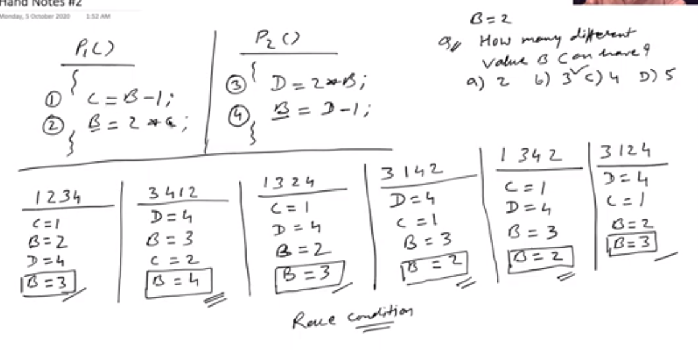
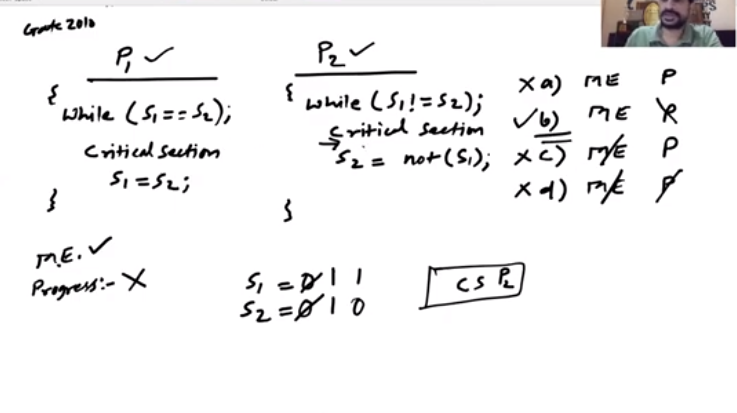
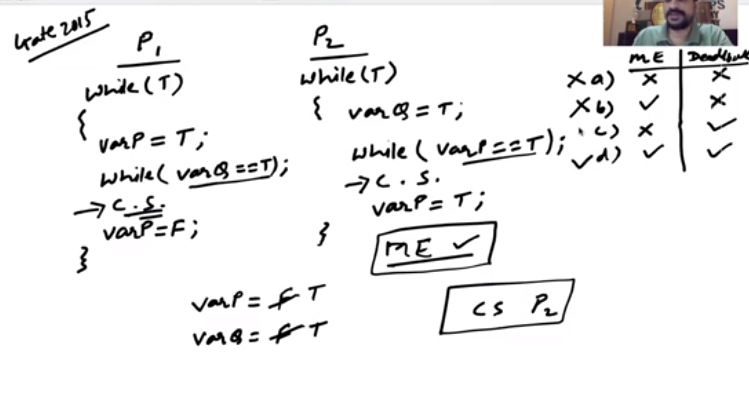

12. Critical SectionProblem

- definition
	- part of program where shared resources are accessed by variour cooperative processes

**critical section problem**
- multiple processes have critical section, but at one time only one problem must be in critical section
- entry section
	- each process should ask permission to enter critical section
- exit section
	- must notify that has exit the critical section
- remainder section
	- not critical

- example
	- :
	```
	do{
		while(turn == j){
		
		} // will go on infinite loop if turn == j
		//------critical section---------
			turn = j //inside critical section
		//------remainder section------------
	} while (true);
	```
* * *
		
**rules for solution to critical section**
- essential rules
	1. mutual exclusion
		- if one process in crit section no other process can go to critical section
	2. progress
		- if no process in critical section
			- some process wants to enter critical section then at some point of time, let it enter
			- some process doesn't want to enter, don't force it
- optional rules
	3. bounded waiting
		- if a process wants to enter, but others are entering, so there must be a bound waiting time after which this process must be allowed to enter its critical secction
	4. No assumption related to hardware & speed


* * *

**criticaal section handling in os**
- preemptive
	- if process in kernel mode, take it out mid process
		- lets see if we can maintain critical section rules
- noon preemptive
	- let the process voluntarily leave kernel mode
		- easy to maintain critical section rules


**Solution to critical section problem**

- examples 
	- 
		- race condition, left with 3 diff values of B
	- example 2
		- p1
			```
			do{
				while(turn == 0){

				} // will go on infinite loop if turn == j
				//------critical section---------
					turn = 0/inside critical section
				//------remainder section------------
			} while (true);
			```
		- p2
			```
			do{
				while(turn == 1){

				} // will go on infinite loop if turn == j
				//------critical section---------
					turn = 1//inside critical section
				//------remainder section------------
			} while (true);
			```


		- here, on preemption
			- mutual exclusion is satisfied becaue 
				- if one goes in critical section, and we preempt it, then also another process can not go to critical section
			- progress is not fullfilled because
				- if p1 came out of critical section, and p2 say preempted, then we p2 can not go to c.s. even if it is free
			- bounded waiting
				- again, if p1 came and p2 preempted after going in critical section, p1 has to wait infinitely
	- example 3
		- p1
			```
			while(1){
				flag[0] = T;
				while(flag[1]){};
				//-------critical section---------
				flag[0] = F
				//-------remainder section--------
			}
			```
		- p2
			```
			while(1){
				flag[1] = T;
				while(flag[0]){};
				//-------critical section---------
				flag[1] = F
				//-------remainder section--------
			}
			```
		- here, for preemption
			- mutual exclusion is satisfied
			- progress is not satisfied, but on top of that, deadlock situation is also possible
				- if we go in p1, change flag[0] now preempt it, then we go to p2 and change flag[1], but now p2 waits for flag[0] to be false, but now even if p2 is resumed, it hasn't gone inside it's c.s. so it will wait infinitely for flag[1] to change...
			- bounded wait not satisfied, as infinite loop

	- example 4 (peterson solution for 2 processes)
		- p0
			```
			while(1){
				flag[0] = T;
				turn = 1;
				while(turn == 1&& flag[1] == T);
				//---------critical section-----------
				flat[0] = F
			}
		- p1
			```
			while(1){
				flag[1] = T;
				turn = 0;
				while(turn == 0&& flag[0] == T);
				//---------critical section-----------
				flat[1] = F
			}
		- here, for preemptive
			- mutual exclusion is satisfied
			- progress is achieved here because of the turn variable (no deadlock! wow!)
			- and bounded wait is also satisfied


	- ------------gate questions ahead---------------
	- 
	- 


**Hardware solution for critical section**

- this solution is based on 
	- locks

- disadvantage
	- for uniprocesssor, no interrupt/preemption
	- too inefficient on multiprocessor
	- os using this is not scalable
- machines provide atomic hardware instruction
	- atomic = non interruptible
- types
	- test() and set()
	- swap()


- test_and_set instruction
	- atomic part
		```
		boolean test_and_set (boolean *target){
		boolean rv = *target;
		*target = TRUE;
		return rv;
		}
		```
	- solution 1
		```
		do{
		while (test_and_set(&lock));
			//--------do nothing--------
		// critical section
		lock = false
		//remainder section
		} while(true);
		```
		
		- here, on non preemption
			- mutual exclusion is satisfied
			- progress doesn't exist because, one process can go again and again
			- bounded wait also doesn't exist


	- solution 2
		```
		do{
			waiting[i] = true;
			key = true;
			while (waiting[i] && key){
				key = test_and_set(&lock);
			}
			waiting[i] = false;
			//-----critical section--------
			j = j = (i + 1) % n;
			while ((j != i) && !waiting[j])
				j = (j+1) % n;
			if (j == i)
				lock = false;
			else
				waiting[j] = false;
			//------remainder section--------
 		} while(true);
		```
		- here, for non preemption
			- mutual exclusion exist
			- progress exist
			- bounded wait exist


- swap Instruction
	- atomic code
		```
		void swap(boolean*a, booolean *b) //simple swaping
		```
		
	- solution 1
		```
		do {
		key = true;
		while(key == true)
			swap(&lock, &key);
		//----critical section--------
		lock = false
		//----remainder section-------
		} while(true);
		```
		
			- here, for non preemptive
				- mutual exclusion exists
				- progress doesn't exist, cause no alteration or no ordering to know if some process is waiting.. so no progress
				- no waiting time, so no bounded waiting


