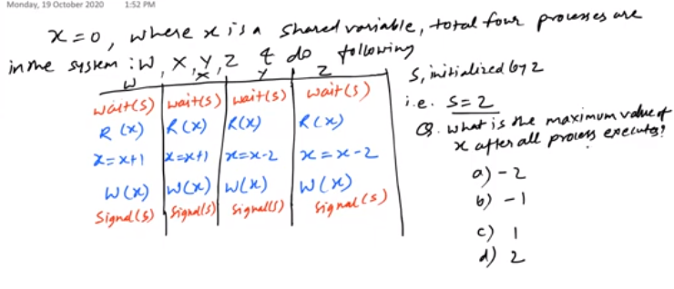
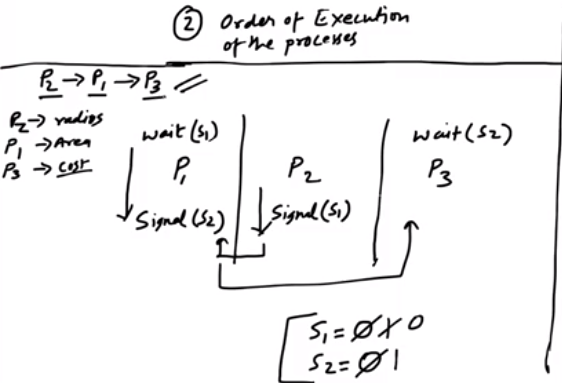
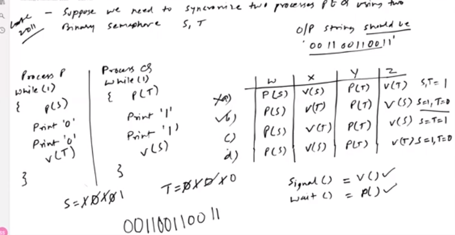
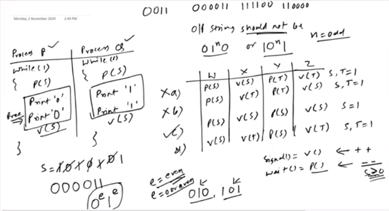
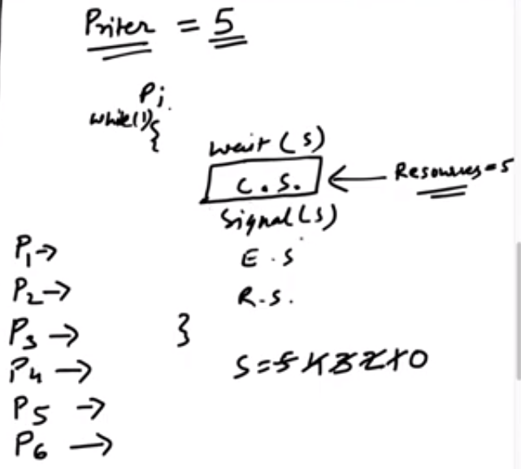
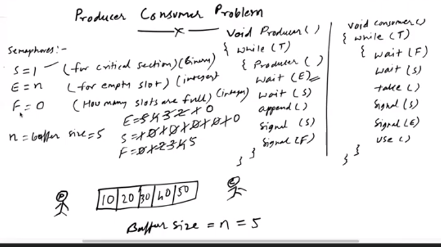

# 13. Sephomore

- meaning
	- an integger variable that apart from initialization, is accessed only through two standard atomic operations(wait & signal)
	- wait()
		```
		wait(s){
			while(s<=0);
			s = s - 1;
		}
		```
	- signal()
		```
		signal(s){
		s = s + 1;
		}
		```
	- solution
		```
		pi
		while(1){
			wait(s);
			//----critical section------
			signal(s);
			//----remainder section-----
		}
		```

		- here, for preepmtive process
			- mutual exclusion is there
			- progress is achieved
			- no bounded wait, as no garuntee, that a process will get c.s.
		


- examples
	- 


- application of semaphore
	- critical section solution
	- order of execution of process
	- resource management


- Order of execution
	- we can do this by having different semaphore for diff. processes
		- and signaling semaphore of next process after ending a process
	- 

	- example
		- 
		- 

- Resource management
	- we can keep the initial value of semaphore to such x
		- which which restricts access of that resource to atmost x processes at a time
	-  


**producer consumer problem**
- the one with buffer
	- where producer should produce if buffer is fulll
	- consumer shouldn'g consume if buffer is empty
- producer
	```
	void producer()
	{
		while (T)
		{
			wait (E)
			wait (S)
			append()
			signal (S)
			signal (F)
		}
	}
	```
- consumer
	```
	void consumer()
	{
		while (T)
		{
			wait (F)
			wait (S)
			append()
			signal (S)
			signal (E)
		}
	}
	```

- semaphore
	- s = 1 (for critical section)
	- e = n (for empty slot)
	- f = 0 (slots that are full)
		- n = buffer_size = 5


- solution
	- 


**Reader writer problem**


- we have a file which we can read or write
	- we can allow simultaneous read
	- we can not allow simultaneous write
	- we can not allow write then read

- write()	
	```
	wati(wrt)
	//----write operation
	sinal(wrt)
	```
	
- read
	```
	wait(mutex)			//this wait, signal is there to protect the readcount value
		readcount++
	if (readcount == 1)
		wait(wrt)
	signal(mutex)
		//----read operatin-----
	wait(mutex)
		readcount--
	if (readcount==0)
		signal(wrt)
	signal(mutex)
	```


**Dining philosopher problem**

- n no. of philosophers and n no. of chopsticks
	- states
		- thinking
			- no resourse
		- eating
			- need 2 chopsticks
- code
	```
	void philosopher()
	{
		thinking();
		wait(chopstick[i]);
		wait(chopstick[(i+1) % 5]);
		eat();
		signal(chopstick[i]);
		signal(chopstick[(i+1)%5]);
	}
	```
	- this solution goes into deadlock if 
		- each philosopher picks up chopstick left to them, 
		- all pick shopscitk right to them

	- solution of deadlock (using additional semaphore)
		```
		void philosopher()
		{
			thinking();
			wait(mutex);
			wait(chopstick[i]);
			wait(chopstick[(i+1) % 5]);
			signal(mutex);
			eat();
			signal(chopstick[i]);
			signal(chopstick[(i+1)%5]);
		}
		```	
		
	- solution 2 
		- n-1 philosophers can eat at a time
	- solution 3 
		- n-1 philosophers pick left first
		- last philosopher picks right first
	- solution 4
		- even philosophers pick left chopstick first
		- odd philosophers pick right chopstick first


