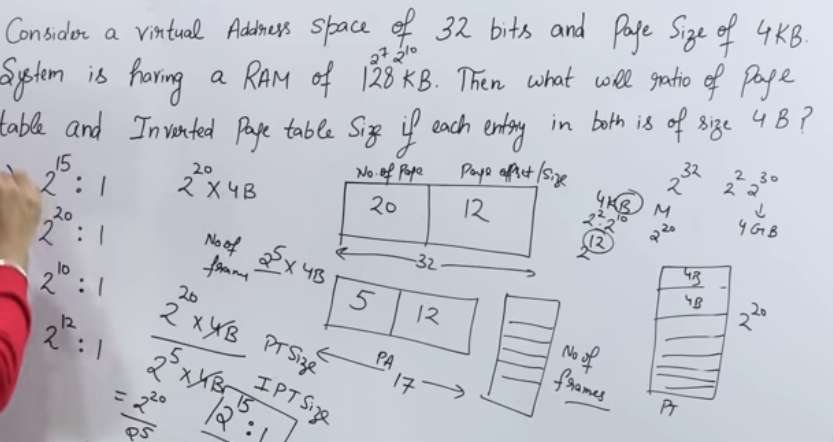

# 15. Memory management

- main points
	- goal 
		- inc. eff.
		- inc. cpu util. (more proc. in ram)
	- memory management technique
		- continuous
			- fixed prtsn (intrnlFrag)(fix(prtsnSz,noOfPrtsn))
			- dynimic prtsn(dynamic. holes, no fix prob.)
			- allocation algo (first, next, best, worst fit)
		- non cont.
			- paging
				- pgTbl (pgNo(LAS) v/s fmNo(PAS))
				- entry (fm.no, invld, perm, repls, cach, drt)
			- inv. pagin (fmNo vs (pgNo, proID))
			- segmentation (sgNo vs (bsAdr, sgSz))
	- overlay

**Introduction**
- goal
	- efficient utilization of memory
- how program use ram
	- 

- analysis of CPU utilization
	- we can have more processes in ram, by increasing its size
	- probability of a process using i/o = k
	- if we have 4 of those processes in cpu, probability is is k4
	- now, cpu utilization is 1 - k4
	- eg. 
		- k = 0.7
			- 1 process
				- cpu utilization = 1 - 0.7 = 30%
			- 4 processes
				- cpu utilization = 1 - 0.74 = 76%

**Memory Management Technique**
- types
	- contiguous (all process data must be in one place)
		- fixed partition (static)
		- variable partition (dynamic)
	- non contiguous
		- paging
		- inverted paging
		- segmentation
		- segmented paging

- contiguous

	- fixed partition
		- constraints
			- no. of partitions are fixed
			- size of each partition may or may not be fixed
			- spanning is not allowed
		- problems
			- internal fragmentation : one processs must go in only one partition, even if space in the partition is left
			- process size limit : process bigger than availbale partition can not fit
			- limitation on degree of multiprogramming : no. of processes more than no. of partition is not allowed

	- variable/dynamic partition
		- advantage
			- we will partition as process comes in, so no internal fragmentation
			- no limit on no. of processes, as no fixed no. of partition
			- no limit on process size, as no fixed size process present
		- problems
			- external fragmentation
				- if processes are terminated and leave ram, we get holes, and fixed partitions are created
				- 
				- now, if a process comes then although it collectively has ram, but it is contiguous and can't
				- solution
					- compaction : make dynamic partition closer
						- it is like cutting those data and pasting to make compact, undesirable, processes would need to be stopped
			- allocation & deallocation
				- it becomes complex because holes are created dynamically
				- we use bitmap and linked list for implementing this, to know where hole is and to manage it

	- contiguous allocation algorithms
		- first fit
			- allocate first hole that process can fit in
			- advantage
				- simple and fast
			- disadvantage
				- uncertainity that what will be internal fragmentation
		- next fit
			- same as first fit but start search from last allocated hole
			- advan/dis
				- same as first fit
		- best fit
			- search intiree memory for hole that is best fitting, least internal fragmentation
			- advantage	
				- less internal fragmentation
			- disadvanatge
				- slow
		- worst fit
			- search and put processes in max internal fragmentation
			- adv/dis
				- same as best fit

- non contiguous memory management 
	- paging
		- introduction
			- here process data can be divided and put at non contiguous places
			- if we divide them dynamically as holes are created dynamically, it will be costly
			- so we divide them to same size in secondary memory and call each division a page
			- and we create frame in memory equal to size of page for ease of fitting	
		- memory is byte addressale for cpu
		- 
		- page table
			- page is stored in secondary memory
			- frame is stored in ram, during processing
			- logical address space (las)
				- local process level addressing for data storage, acc. to data stored in secondary memory
				- contains entries : 
					- page no. (in msb)
					- offset/bit no. (in lsb)
			- physical address space (pas)
				- memory level addressing for data storage
				- contains entries :
					- frame no. (in msb)
					- offset/bit no. (in lsb)
			- page table maps page no. of LAS to frame no. of PAS for use by cpu
			- example
				- 

		- page table entry
			- 
			- frame no : at what frame is this page stored
			- valid/invalid : tells if page is at frame locaation or it is swapped out (page fault)
			- protection : the right to read, write, execute
			- reference : if this page was in memory before too
			- caching : if enabled or disabled
			- dirty : if data has been modified, to note that frame is modified but page might not be

		- multilevel paging
			- lets say, size of page table = p
			- size of frame  = p2
			- we want to store the page table in frames
			- now, if p > p2, 
			- we divide page table into p1 = p/p2 smaller tables store in frames 
			- we store the address of these p1 frames into an outer page table
			- 

	- inverted paging
		- in traditional page table
			- each process has it's own page table
			- and each page table is stored in main memory, which is costly sometimes
		- now here, 
			- there is only one page table for all the page processes, where we map frame no. to (page no, process id)
			- 
			- memory is low, but time for search is increased

		-example
			- 

	- segmentation
		- paging divides data/code into equal codes, which might not be semantically complete
		- so, to keep symantically complete data together, we use segmentation which creates segments of different sizes
		- here we have segment table, which maps, segment no. to (base address, size)
			- 
		- similar to logical address of page table, here also we have segment no, and size/offset which should be less than size of segment table.

	- overlay
		- we can put a process whose size is greater than main memory into main memory
		- we move in needed data, and move out unneeded data
		- it is used in embedded system, and there is no driver which can do this, so we have to do this manually
		- 

