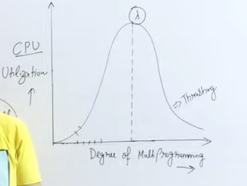
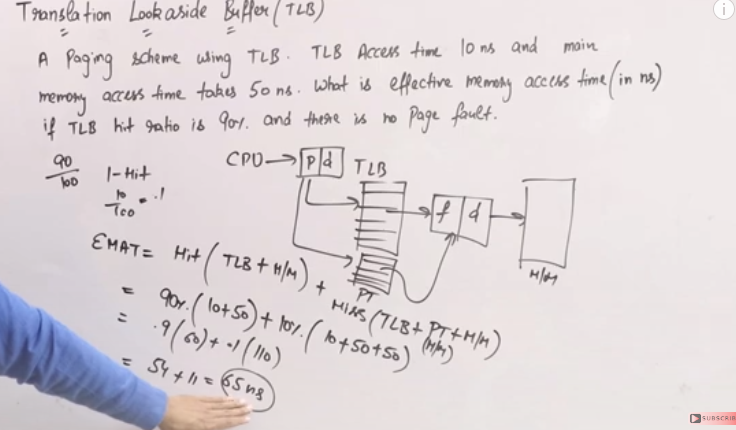
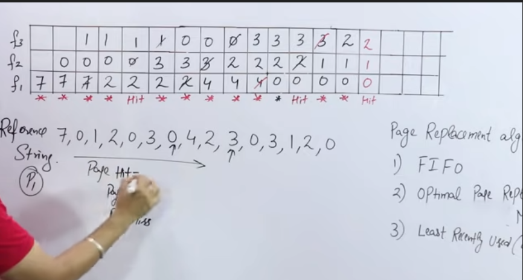
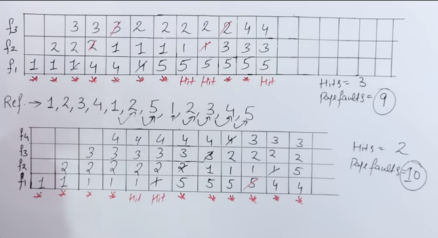
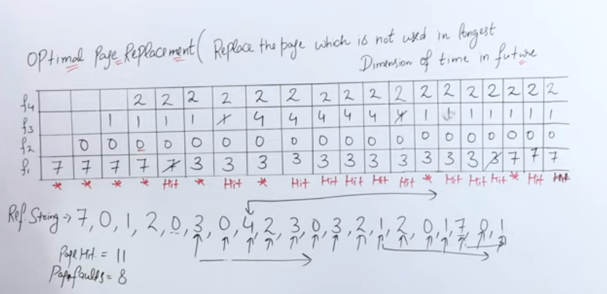
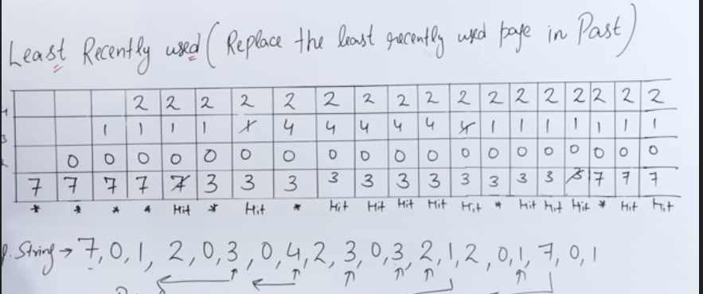
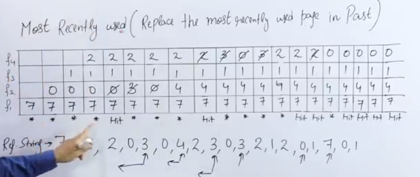

# 16. Virtual memory

- main points
	- concept of virtual memory
		- swap
		- page fault service
		- thrashing
	- translation lookaside buffer (virtual memory at page table level)
	- page replacement algos.
		- FIFO
		- Optimal (future)
		- LRU (past last)
		- MRU (past first)


**Virtyal memory**
- advantage
	- it creates an illution that the process whose size is greater than main memory can also execute 
	- we do this by swapping in only required pages from secondary memory, and swap out non required pages, this is page replacement
- page fault
	- let's say the page required by cpu asap
	- it is showing invalid in page table
	- so this generates a page fault interrupt
	- now, control goes to os
	- os authenticates the user and finds the page in logical address
	- and adds it in the main memory
	- and update the valid, and frame no. in page table
	- now control is again returned to user
	- effective memory access time
		- p : probability of page fault
		- emat = (page fault service time)*p milli.sec + (1-p)*(main memory accesss time) nano.sec.

* * *
**thrashing**
- if we have lots of page tables of little pages, cpu is idle most of time, so cpu utilization becomes low
- the more process in memory the greater the degree of multiprograming, the more cpu utilization
- if we swap in too many processes and emat is low cpu utilization decreases again, this is **thrashing**
- so we try to maintain swap in at an optimal level
- 
- solutions for thrashing
	- increase available memory 
		- not practical
	- tell long term scheduler to slow down


* * *

**translation lookaside buffer**
- generally
	- if cpu requests some process data
	- time to access page table = x
	- time to search and find the frame no. = x
	- emat = 2x
- now in TLB we use a cache to store page no. vs frame no. rows which are accessed frequently
	- so now, if TLB hit (found in tld) = tlb
	- if TLB miss, still have to search page table = x
	- and finally frame no. search time = x
	- so here, 
		```
		emat = 
		(TLB + x) +	//in case of hit
		(TLB + x + x)	//in case of miss
		```
	- example
		- 


**Page replacement algorithms**

- FIFO
- Optimal Page Replacement
- Least Reently Used (LRU)
- Most Recently Used

- FIFO
	- we swap out earliest swap in with new spaw in, if the no. of frames are all filled, else we swap in at the next expty slot
	- 
	- 
	- belady's anomaly
		- here on above example, we increased the frame no. but hits reduced, this is a problem with FIFO


- Optimal Page Replacement algorithm
	- replace page which is not used in longest time in future
	- 


- Least Recently Used algorithm(LRU)
	- replace the least recently used page in past
	- 


- most recently used algorithm
	- replace the most recently used page in past
	- 


