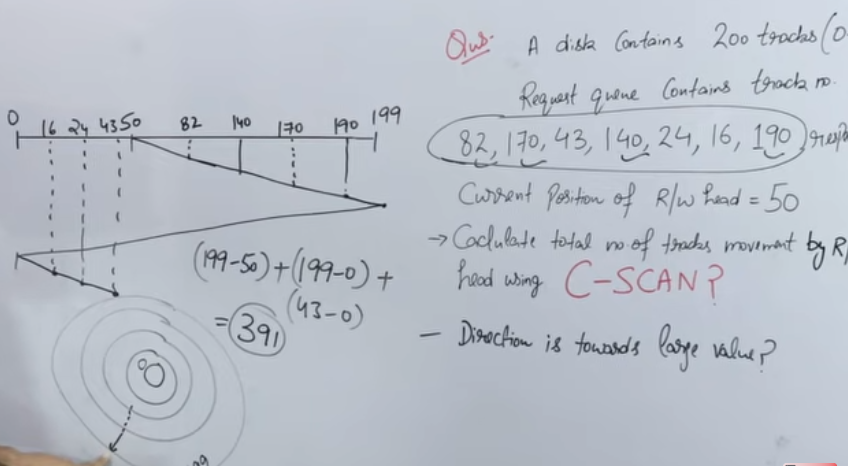
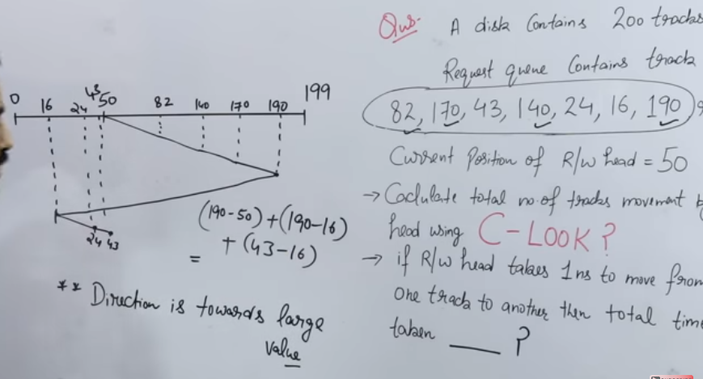

17. Disk Management

- main points
	- driver & controller 
		- diff
		- types
	- disk access time (sum)
		- seek time
		- rotation time & latency
		- transfer time
	- disk access scheduling algos.
		- FCFS
		- SSTF
		- SCAN & CSCAN
		- LOOK & CLOOK

**Device driver & device controller**

- both are in b/w os and hardware(device)
- device driver
	- is software
	- every divice has driver, and when plugged in first driver is installed
	- types 
		- kernel device driver
			- inbuilt hardware
		- user device driver
			- if we add extra devices, pen driver etc.

- divice controller
	- is in b/w device driver and it's hardware
	- is hardware
	- some buffer is found
	- a device controller may be able to handle multiple devices
	- types
		- simple (serial port controller)
			- mouse, keyboard
		- complex (scsi)
			- small computer system interface, eg harddisk

**Disk access time**
- seek time (most important, as higher than others)
	- time take by r/w head to reach desired track
- rotation time
	- time taken for one full rotation
- rotation latency (ave)
	- time taken to reach desired sector (half of rotation time)
- transfer time
	- data to be transfer/ transfer rate(data rate)
		- transfer rate = no. of heads * data of one track * no. of rotation in one sec. + controller time (optional)

- disk access time
	- seek time + rotation time + rotation latency + transfer time + controller time (optional) + queue time (optional)

**Disk Scheduling Algorithms**
- goal
	- to minimize seek time
- algos
	- FCFS
	- SSTF (shortest seek time first)
	- SCAN
	- Look
	- CScan (circular scan)
	- CLook (circular look) 

- First Come First Serve (FCFS)
	- serve acc. to request queue
	- no starvation
	- but performance is low
	- 

- Shortest Seek Time First (SSTF)
	- we go to the track no. which is closest from current position
	- 
	- average performance is good
	- due to searching nearest seek time, overhead is increased
	- starvation is found here

- SCAN (elevator algorithm)
	- acc. to given direction go to the last track, but on reversing, go to last request
	- 

- LOOK 	
	- similar to SCAN, go to given direction but only upto last requested tract, change direction, do similarly
	- slightly better than SCAN
	- 

- C-SCAN algorithm
	- algos
		- from the start location, go to end of given direction while fullfilling request
		- now reverse and go to the other end WITHOUT fullfilling any request
		- now reverse again and fullfill request while goint to start position
	- 

- C-LOOK
	- algo
		- go to the given direction fullfilling request upto last request
		- reverse and WITHOUT fullfilling, go to the request at the farthest
		- now, reverse again and fullfill remaining requests
		- 

**RAID**
- redundant array of independent disks
	- multiple hard drives that act like a single drive
	- they are controlled with the help of a scsi
		- scsi decides wihch drive get which data
- it improves fault tolerance through mirroring and parity
	- mirroring makes duplicates
	- parity uses minimum three hard drives, and data is written sequentially to each drive except tha last one, which stores checksum

