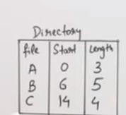
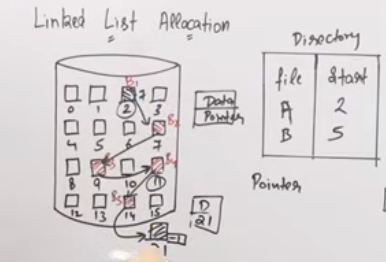
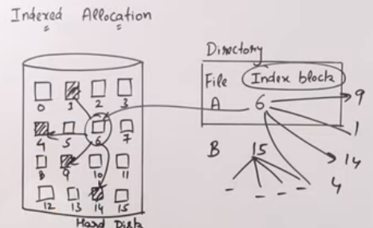

# 18. File Management

- main points
	- job of file system (files > blocks)
	- file attribution
		- operations (rd, cr, rm, tr, wr, repos)
		- attributes (nm, ext, sz, id, dt, prmsn, encr)
	- allocation methods
		- continuous (file id, start addr, size)
		- non 
			- link list (file id, start addr)
			- indexed (file id, index block)
				- unix inode	

**File System**
- there is module in OS, which manages files	
	- windows has ntfs
	- linux has extended (ext4)
	- big data has zfs
- work
	- how data will be stored
	- how data will be fetched

- heirarchi
	- user needs data
	- data stored in files
	- files managed in folder/directory
	- which is managed in file system

- file system
	- file system logically divides files into blocks
	- now we can map these blocks in sectors of secondary storage

**File Attributes**
- operations on files
	- creation (touch)
	- reading
	- writing(echo)
	- deleting (rm)
		- deletes attributes
	- truncate
		- doesn't detete attributes
	- repositioning (lc)
- File Attributes (meta data stored in secondary storage)
	- name
	- extention
	- identifier
		- id for the file
	- location
		- path to the file
	- size
	- modified/created date
	- permission/protection
		- user/groups/read/write/execute
	- encryption, compression

**Allocation Methods**
- purpose
	- effective disk utilization
	- fast access 
- types
	- contiguous allocation
	- non contiguous allocation
		- linekd list allocation
		- indexed allocation

- contiguous allocation
	- directory
		- 
	- advantage
		- easy to implant
		- excellent read performance
	- disadvantage
		- disk will become fragmented
			- internal fragmentation
				- some space remains blocks 
			- external fragmentation
				- some blocks may get unfilled
		- difficult to grow file
			- because we might not get contiguous blocks

- non contiguous allocation
	- linked list allocation
		- implementation
			- we will have pointer of next block with the block
			- and the last will have next pointer as -1
			- 
		- advantage
			- no external fragmentation
			- file size can increase
		- disadvantage
			- large seek time
			- random access
			- overhead of pointer

	- indexed allocation
		- implementation
			- 
		- advantage
			- support direct access
			- no external fragmentation
		- disadvantage
			- pointer overhead
			- multilevel index

		- unix uses this allocation method : inode

**Unix Inode Structure**
- architecture
	- size of a data block is 128 Bytes
	- size of block address is 8 Bytes
- is a data structure which contains
	- attributes (name, extention etc.)
	- direct blocks
		- direct pointers to data blocks
		- there 8 direct blocks

	- single indirect 
		- contains pointer to a data blocks which contains pointers to more data blocks
		- there is one indirect block
	- double indirect
		- contains pointers to single indirect 
		- there is one double indirect
	- triple indirect
		- contains pointers to double indirect
		- there is one triple indirect
- size of disk represented by one inode
	- one block contains pointers
		- size of block / size of block address = 128 B / 8 B = 16 no of pointers in a data block which single indirect points to
	- (8 + 16 + 16*16 + 16*16*16) * 128 B = 547 KB

