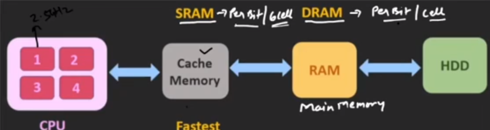
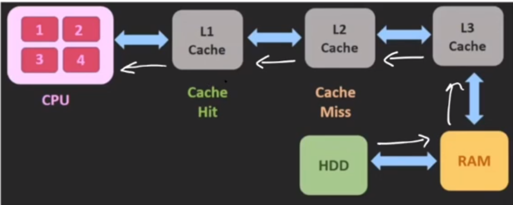

2. Storage

- main memory (dram - dynamic)
	- only large storage that cpu can access
	- random access
	- typically volatile
- secondary storage
	- extension of main memory
	- provides large non volatile storage
- hard disk
	- spindal contains platters
	- rigid metal or glass platters covered with magnetic recording material on both side
	- disk surface divided into tracks, which are subdivided into sectors
	- read/write head is there to the both surfaces of disk
	- disk controller determines logical interaction b/w the disk and os
	- disk size = platter/hard disk * surface/platter * track * sector/track * data/sector
- solid state drive
	- faster
	- non volatile
- cache memory (sram)
	- special high speed memory to sync with high speed cpu
	- acts as a buffer bw ram and cpu
	- costlier than main memory, but economical than  register
	- 
	- types of cache memory
		- 	
		- level 1 : 2kb to 64 kb, stored data cache & instruction cache
		- level 2 : outside cpu, 256kb to 512 kb
		- level 3 : slower than l1 & l2, 1mb to 8mb

- bit byte kb, mb, gb, tb, pb, xb, eb