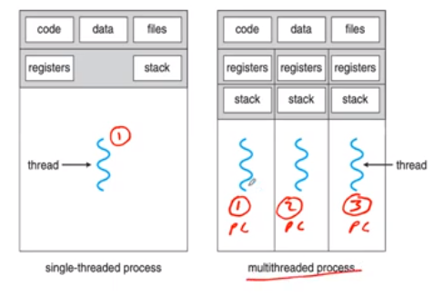
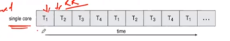
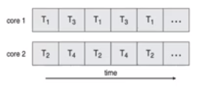

10. Threads

- main points
	- thread (basUniCpUtil)
		- attr : thrId, pc, regSet, stck
		- share : cd, dt, osRes
		- benifit : resp, resShr, eco, scal
	- parellelism type(data pll(gpu), task pll(cpu))
	- thread type (user(posix,java), kernel(sysCall))
	- multithread mode (krnlThrd : usrThrd)(m:o, o:o, m:m)

**Introduction**

- thread
	- definition
		- basic unit of cpu utilization
	- comprises
		- thread ID
		- program counter	
		- register set
		- stack
	- shares with other thread belonging to same process
		- code section
		- data section
		- os resources (open files, signals)
	- heavyweight process has one thread
	- if process has multiple thread
		- it can perform more than one task at time
	- 

- benifits
	- responsiveness
		- user can run program even if it is performing some other task rn
	- resource sharing
		- multiple threads share similar resources, within same address space
	- economimc
		- process creation and context switching is costly because new resources need to allocate, here no such
	- scalability/utilization of multiprocessor arcitecture

- multithreaded server architecture
	- client --(request)--> server (listen to req) --(create new thread to service request)--> thread

**multicore programming**
- types of paralllelism
	- data parallelism (gpu)
		- distribute subset of same data across multiple cores, same operation on each
	- task parallelism (multi thread)
		- distribute threads across cores, each thread perform uniq operation
- As # no threads grow, architecture support for threading increases
	- cpu have cores as well as hardware threads
	- eg. oracle sparc t4 has 8 cores, and 8 threads per core

**concurrency vs parallelism**
- concurrent execution on single core system
	- 
- parallelism on multi core system
	- 

**Types of thread**
- User thread
	- management done by user level threads library
	- three primary thread libraries
		- posix pthreads
		- windows threads
		- java threads
- kernel threads
	- supported by kernel (system call, handling interrupts)
	- examples
		- in all os like linux, windows etc

**Multithreading Models**
- many to one
	- many user level thread map to single thread
	- one thread blocking causes all to block
	- only one thread in kernel thread, so not good for parellism
	- eg. solaris green threads, gnu portable threads
- one to one
	- each user level thread maps to kernel thread
	- creating user thread creates kernel thread
	- more concurency
	- no. of threads per process sometimes restricted
	- eg. windows, linux, solaris 9 etc
- many to many
	- allows many user threads mapped to many kernel threads
	- allow os to create sufficient no of kernel thread
	- eg. 
		- solaris prior to version 9
		- windows with thread fibre package

**Hyper threading**

- meaning
	- it is simultaneous multithreading
	- divides processor cores into multiple logical processors for performance
	- processors can execute two threads/ instrutions at  same time
	- it is like two processors in parallel
- we can find cores, logical processors with commands
	- windows
		- wmic
		- CPU Get NumberOfCores, NumbeOFLogicalProcessors
	- unix
		- something

