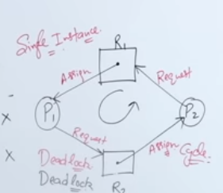
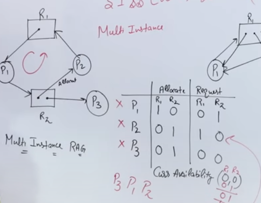
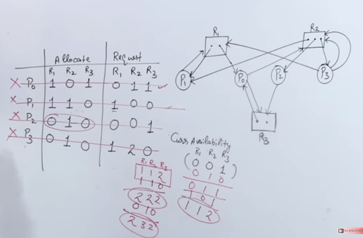
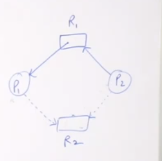
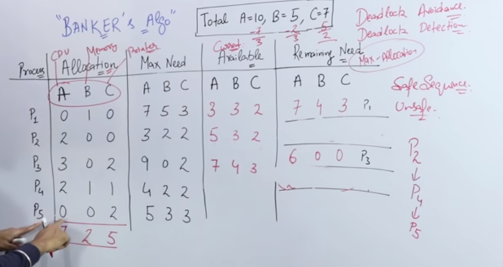

14. Deadlock

- main points
	- coffmanCondition(mutExc, hldWt, noPrm, cirWt)
	- ddlk hndl
		- ignorance
		- prevntion (stop coffmanCondition)
			- hldWt : atomic res.aloc
			- cirWt : aloc resNo > last aloc. resNo
		- avoidance
			- stp if sing rag circular
			- bnker(pid,alocated+-,maxNeed,avai_+,remNeed-_)
		- recovery (kill proc, kill res.)

**Introduction**

- definition
	- when multiple processes are holding some resources and waiting for the other to release somo other resources
- coffman condition (a deadlock if all four coffman condition true)
	1. mutual exclusion
		- one process can use shared resource at a time
	2. hold and wait
		- a process is holding atleast one resource and waiting for resource
	3. no preemption
		- a resource cannot be taken away before it releases
	4. circular wait
		- a set of proesses are waiting for each other to release resources

- deadlock detection
	- ability to detect deadlock
	- after detected it can be resolved by
		- all processes in deadlock are terminated
			- not a good approack
		- resources can be preempted from some processes and given to others till deadlock resolved
- deadlock prevention
	- preventing deadlock by checking each transaction before it executes to stop if it can lead to deadlock

- deadlock avoidance
	- wait for graph can be used for small databases

**Resources Allocation graph**

- graph 
	- vertex
		- circle
			- process
		- box with dots
			- single dot
				- single instance resource
			- multiple dots
				- multiple instance resource
	- edge
		- circle to box
			- requesting resourcee
		- box to circle
			- resource accessed

- example
	- 
		- if single instance RAG has cycle, it's a deadlock
	- 
	- 

**Deadlock handling**

- deadlock ignorance (ostrich method)
	- ostrich as in, ostrich puts its head in sand whenever there is sandstorm, it ignores the sandstorm
	- deadlocks rarely occur, like in os
	- in windows, linux
	- good for speed
- deadlock prevention
	- prevent deadlock before deadlock occurs
	- ways
		- try to remove as many coffman conditions as possible
			- remove mutual exclusion
			- use preemption
			- stop hold and wait
				- e.g. if a process can't get all resources.. it cant have any
			- removing circular wait
				- each process can request the resourse no. that is greater than the last resource no. that was requested
					- lets say p1 requests r3, and has r1, now if p2 comes it can request r4 but won't be able to request less than r4.. i.e. r2
- deadlock avoidance 
	- RAG method (single instance)
		- here dotted line means that may request that resource in future
		- 
		- so if there is any kind of loop forming then deadlock will arise, so we won't allow those certain requests
	- bankers algo
		- checking if requesting a resource is safe or not
		- algo given by djikstra
		- done by making a table
		- 
- deadlock detection and recovery
	- if deadlock detected, recovery includes
		- kill processes and keep checking if deadlock still exists
		- resource preemption, take away resources from some processes

