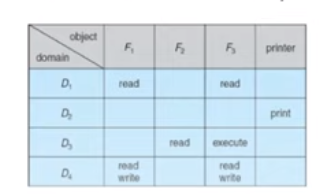

19. Protection and security

- main points
	- CIA (violation category)
	- principle of least privilege
	- domain: object vs permission
	- security measure level : physical, human, os, network

**Goal**
- in protection model, there are objects which can be hardware/software
- each object has unique name and can be accessed through a well defined set of operations
- we need to ensure that each object is accessed correctly and only by those processes that are allowed to do so

**Security Violation Categories (breach of CIA)**
- Breach of Condidentiality
	- unauthorized reading of data
	- solution
		- encryption
- Breach of Integrety
	- unauthorized of modification of data
- Breach of availability
	- unauthorized destruction of data
- Theft of service
	- unauthorized use of resources
- Denial of Service (DOS)
	- prevention of legitimate use

**Principles of protection**
- principle of least privilege
	- programs, users and systems should be given just enough privileges
	- this limits damage if an entity has a bug or gets abused
	- privilege can be 
		- static
			- during life of system
			- during life of process
		- dynamic
			- changed by process as needed
				- switching
				- privilege escalation
	- "need to know" is a similar concept like this

**Domain Structure**

- Domain
	- in domain we have
		- set of 
			- access rights
				- objects
				- permissions (read, write, execute, print)

**Access Matrix**
- matrix of Domain no., vs Objects
	- here fields tell premissions
- 
- similarly we can also use
	- table
	- ccapability model

**Security Problem**
- sevure
	- system is secure if resource used and accessed as intended under all circumstances
		- which is unachievable
	- intruders
		- attempt to breach security
	- threat
		- potential security violation
	- attack
		- attempt to breach security
			- can be accidental or malicious
				- accidents are easier to protect against

**Security Violation Methods**
- Masquerading
	- breach authentication
	- pretending to be authorised user to escalate privileges
- Replay attack
	- message modification

- Man in the middle
	- intruder sits in data flow, masquerading as sender to reciever and vice versa
- session hijacking
	- intercept already established session to bypass security

**Security Measure Levels**
- security must occur at four levels
	- physical
		- data centers, server, connected terminal
	- human
		- avoid social engineering, phising, dumpster diving
	- operating system
		- protection mechanism, debugging
	- network
		- intercepted communication, interruption, DOS

**virus**
- attaches itself to files, so that can spread from one computer to another, leaving infection
	- it is attached to executable, so it may be in computer but can't infect computer unless we run it

**worms**
- subclass of virus
- travels b/w computer by file transport feature like udp etc

**port scanning**
- try to spoof ports of pc

**DOS**
- send so many packets so that genuine userc can't get response

**Firewall**

- limits network access b/w trusted and non trusted hosts

