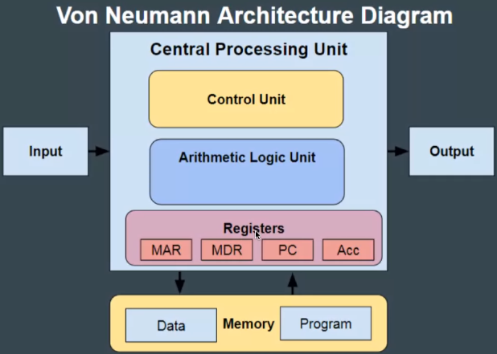
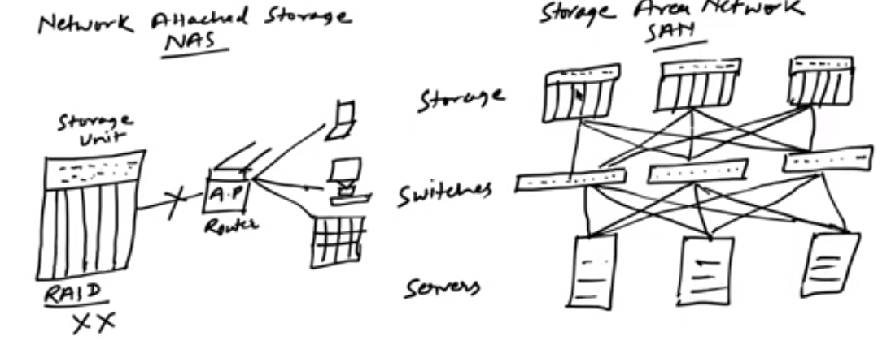

3. hardware

- Register:
	- not a part of main memory
	- smallest data holding element
	- temporarily hold frequently used data, instruction and memory address to be used by cpu
	- holds instruction that are curently processed by cpu.
	- all data is passed thru reister bebore process
	- can hold around 32 bit and 64 bit
	- spedd of cpu depends on no. and size of registers

- type of register
	- data register 
		- 16 bit, stores operands
	- program counter	
		- 12 bit, holds address of next instruction
	- instruction register
		- division
			- type of addressing(1 bit) 
				- direct address (0)
					- like pointer
				- indirect address (1)
					- like pointer to pointer
			- op-code 3 bit
			- data/operand address of 12 bit
	- accumulator register 
		- 16 bit stores procesed result
	- address register 
		- 12 bit, address of memory where instruction of data stored
	- io add reg
		- address reg specify address of io device
	- io buffer reg
		- exchange data bw i/o module and cpu

- note:word is of 2 byte(16bit), main memory is a collection of words like 4096(inidices) x 16(word)

**heirarchy of io**
- more volatile, fast and costlier
	- register
	- cache
	- main memory

- non volatile, slow and cheaper and longlasting
	- ssd
	- hdd
	- optical drive
	- magnetic tape

**von neumann architecture**

- data/instruction reside in mein memory and when cpu want it gets from there

cache :
	
	cache hit - cache is available
	cache miss - cache isn't available
	

**computer-system architecture**

- most systems have a single general purpose processor(maybe special purpose)

- multiprocessors systems -

	- growing in  use and importance 
	- also known as 
		- parallel system, 
		- tightly-coupled system
		
	- advantage:
		- increased throughput
		- economy of scale
		- increased reliability (multiple processors)
				
	- types:
		- asymmetric multiprocessing 
			- each processor is asigned a special task
		- symmetric 
			- each processor do all the task
			- similar are multicore processors

- clustered systems
	- like multiprocessor system, but multiple systems working together
		- 
		- network attached storage (NAS)
			- multiple devices connected to a storage
			- (RAID(redundant array of i data))
		- storage area natwork(SAN)
			-  multiple storages connected to multiple switches which devices can connect to

			- types
				- asymmetric - one server
				- symmetric - multiple server
			- some are high performance computing (parelle and stuff)
			- soom have dlm(distributed lock manager)

