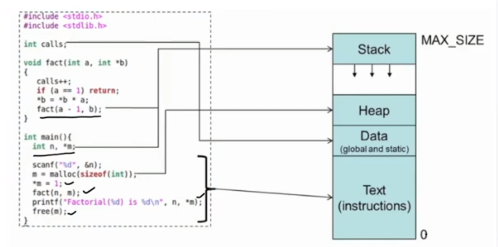
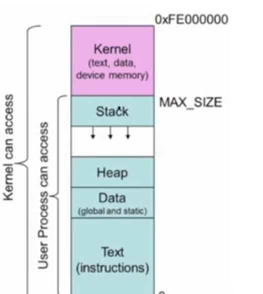
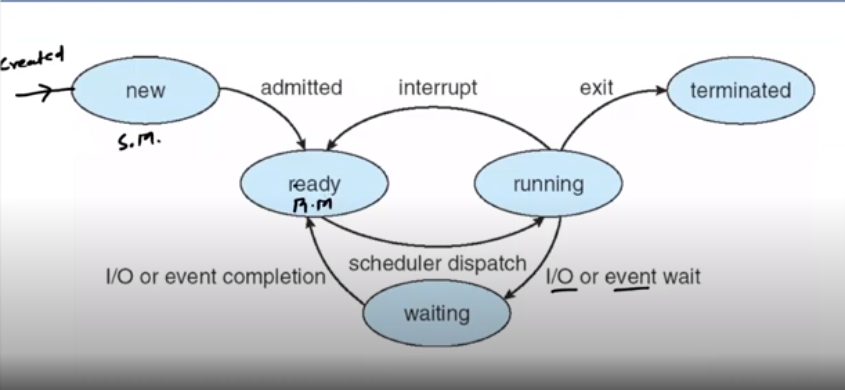
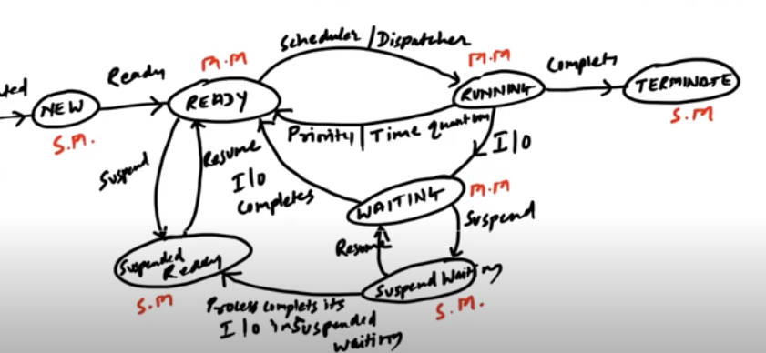

6. process

	
	
**process**
- is a program in execution
- presents in ram
- comprises of 
	- executable instruction
	- stack
	- heap
	- state in OS (in kernel)
		- state contains:
			- registers, list of open files, related process etc
	- 

- access
	- kernel has
		- text, data, device memory
	- user process has
		- stack(for storing pointers, recursive function)
		- heap (for storing malloc etc)
		- data (global and static)
		- text instruction
- process concepts
	- os system executes variety of programs:
		- batch system (jobs)
		- timeshared system (user programs or tasks)
	- job and process are same
	- process 
		- a program in execution, process must progress in a sequencial  fashion
	- multiple parts
		- code (text)
		- program counter, process register
		- stack containing temporary data
		- data section containing global variables
		- heap containing dynamic memory allocation
	- when program(exe) is in disk it is passive, when exe loaded in memory it becomes process is active
		- diff. process can be created out of a program for diff. users
	- 
	- this is all in virtually memory space

**Process Control Block (context)**

- process control block or context or attributes or task control block
	- process state
	- process no
	- program counter
		- keeps location of instruction to next execute
	- priority of process
	- cpu register
	- cpu scheduling info
		- priority, scheduling queue pointers
	- memory-management information
		- mem aloc to proc
	- accounting info
		- cpu used, clock time elepsed, time limit
	- i/o devices allocated (list of open dev)
	

**Process state**
- new
	- process being created
	- is in secondary mem
- ready 
	- waiting to be assigned to processer
	- in main memory
- running
	- instructions are being executed
	- in main memory
- waiting/ block
	- waiting for some event to occur
	- main mem/ secondary memory
- terminated/completed
	- finished
	- secondary memory
- suspended ready
	- suspended waiting to be assigned to processor
	- secondary memory as another process has taken its place
- suspend waiting/suspend block
	- waiting for some more event to occur
	- secondary memory
- 

**multiprogramming** 

- preemptive
	- if a higher priority process comes than that in the processor, then it is forcefully stopped(goes into suspended ready) and exchanged, now if the process was in waiting then it goes to suspend waiting, BY SCHEDULER DISPATCHER
- non preemptive
	- no such thing is done

- including suspended
	

**scheduler**
- long term 
	- from new state to ready state
	- chooses long term processes
	- decides which process goes to ready queue
	- controls degree of multiprogramming
	- invoked infrequently in seconds, minutes
- medium term
	- running to waiting and waiting to ready
	- removes from memory stores on disk or brings back
	- selects which processes should be brought to suspended ready and suspended waiting, also called swap
	- to manage main memory
	- if any high priority comes then low priority goes to suspended state (if no much memory left in ram)
- short term
	- ready to running state
	- dispacher which decides which programms should be executed next \
	- many times only one
	- invoked frequently in milliseconds

**process scheduler**
- help quickly switch process
- selects among available processes for next exec
- maintains scheduling queue of processes
	- job queue
		- set of all processes in system
	- ready queue
		- set of process in main memory
	- device queue
		- set of processes waiting for i/o devices

**context switch**
- the old process state must be saved and new process is loaded from save state, with help of context switch
- context of process represented in PCB
- the more complex os and pcb, longer is context switch time

**Fork/exec/exit**
- in unix earlier
	- shell was a part of the kernel, and only the app was opened in the user space and once the program used to close we did not get previous shell, because it already closed, we solve this problem with exec
	- but now shell is a part of the user space itself
- exec
	- it is used for the system call, which takes a file as argument, and opens it
- fork
	- once command is given in the shell, then a fork command is executed 
	- then a duplicate terminal is opened with the child id stored in the parent terminal, and 0 stored in child terminal
	- the parent terminal goes to secondary memory
	- now in the child terminal the exec command is used, which executes the program and closes the child terminal.
	- now on exit(), we return to the forked terminal

