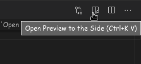
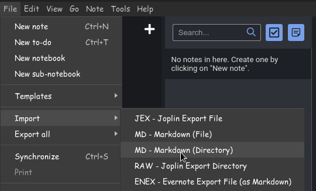

# Operating-System-Notes
Notes of Operation System Course, prepared for semester exam of B.Tech.
```
Note : pull requests are most wellcome.
```

**Source of Learning :**
- Dr. Suraj Sharma https://www.youtube.com/watch?v=YvWYoa57MBQ&list=PLouQm2URN206sv146l0SurzkhHc2hbUcJ
- Gate Smashers https://www.youtube.com/watch?v=rWFH6PLOIEI&list=PLxCzCOWd7aiGz9donHRrE9I3Mwn6XdP8p&index=38


**Instruction for editing notes :**
- with VS code
    - have basic knowledge of markdown rules/syntax
    - you can open the README.md file in vs code and then click on 'Open Preview to the Side' button on top right
        - 

- with Jopline note maker
    - origanally the notes were created using Joplin
    - all notes can be imported by selecting this option
        - 

- with Github
    - just fort and edit

